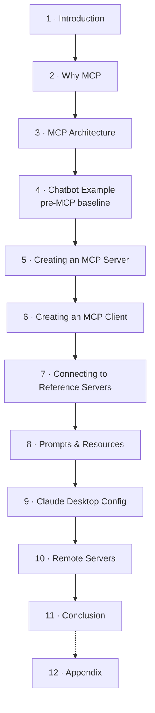

# 🗺️ MCP: Build Rich-Context AI Apps with Anthropic — Map of Content

A short DeepLearning.AI course on the **Model Context Protocol (MCP)** — an open
protocol that standardizes how LLM applications get 
- tools
- data, and 
- prompts 
from external servers, decoupling capabilities from the app via a client–server model.

These notes distill all 13 lessons into an Obsidian knowledge graph: read on your
phone, refine on desktop. See [[mcp]] and [[mcp-architecture]] to start.

## Lesson flow

## Lessons
| # | Note | Theme |
|---|------|-------|
| 1 | [[01-introduction]] | What MCP is, course roadmap |
| 2 | [[02-why-mcp]] | The M×N integration problem → standardization |
| 3 | [[03-mcp-architecture]] | Host / client / server, primitives, transports, JSON-RPC |
| 4 | [[04-chatbot-example]] | Pre-MCP tool-use loop (the baseline to wrap) |
| 5 | [[05-creating-an-mcp-server]] | `FastMCP`, tools, stdio, Inspector |
| 6 | [[06-creating-an-mcp-client]] | `ClientSession`, the connect lifecycle |
| 7 | [[07-connecting-the-mcp-chatbot-to-reference-servers]] | One client, many servers |
| 8 | [[08-adding-prompt-and-resource-features]] | Resources + prompt templates |
| 9 | [[09-configuring-servers-for-claude-desktop]] | A real host consumes your server |
| 10 | [[10-creating-and-deploying-remote-servers]] | Local → remote transport ⚠️ |
| 11 | [[11-conclusion]] | Recap + ecosystem roadmap |
| 12 | [[12-appendix-tips-and-help]] | Notebook tips (reading material) |

## Concept atoms
**Core:** [[mcp]] · [[mcp-architecture]] · [[json-rpc]]
**Roles:** [[mcp-host]] · [[mcp-client]] · [[mcp-server]]
**Transports:** [[transport]] · [[stdio-transport]] · [[streamable-http-transport]] ⚠️
**Server primitives:** [[tools]] · [[resources]] · [[prompt-templates]]
**Tooling & patterns:** [[fastmcp]] · [[mcp-inspector]] · [[tool-use-loop]] · [[claude-desktop-config]] · [[remote-server]]

## Companion artifacts (outside the vault)
- 🧪 **Modernization report** — `reports/modernization.md` (what's stale: SSE transport, model id, junk deps)
- 💻 **Refactored assignment** — `solutions/` (CMU/Stanford-style package + autograder)
- 📄 **Source** — transcripts in `raw/transcripts/`, original notebooks in `raw/assignments/`

> [!tip] Phone takeaway
> MCP is "USB-C for AI apps": build a **server** once (tools/resources/prompts), and any
> **host** (your chatbot, Claude Desktop, …) can plug in through a standard **client**.
