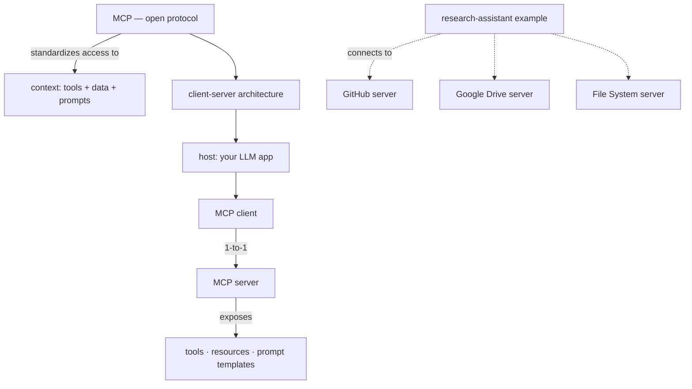

# Lesson 1 — Introduction

> **One-line:** Course orientation — [[mcp]] is an open, model-agnostic protocol that
> standardizes how LLM apps pull in context (tools + data) via a **client–server**
> design; here's the map of what you'll build.

## Concept map

## Why this lesson exists

Sets the frame for the whole course. Andrew Ng and instructor **Elie Schoppik** (Head of
Technical Education at Anthropic) introduce [[mcp]] — the **Model Context Protocol** —
the thing that makes connecting LLM apps to many tools and data sources easy on both
sides. 

The detailed *why* is [[02-why-mcp]]; the detailed *how* is [[03-mcp-architecture]].

## Key ideas

### What MCP is
An **open protocol** that standardizes how LLM applications get **context** — namely
[[tools]] and **data resources** — built on a client–server architecture. 

It defines how
an [[mcp-client]] (hosted inside your app) talks to an [[mcp-server]] that exposes
- [[tools]]
- [[resources]], and 
- [[prompt-templates]].

### Where it came from
Originated inside Anthropic to let Claude Desktop reach local files and external systems.
It generalized, so Anthropic **published the spec and open-sourced it** (Nov 2024). It is
**model-agnostic** and the ecosystem is growing fast.

### The motivating example
A research-assistant agent that needs GitHub repos, Google Drive notes, and the local
file system. 

Instead of hand-writing custom LLM tools for each, you **connect to existing
servers** that supply both the tool/API definitions and the execution.

## Course roadmap (what you'll build)
1. Make a chatbot MCP-compatible → [[04-chatbot-example]]
2. Build and test a server → [[05-creating-an-mcp-server]]
3. Build a client and connect → 
	1. [[06-creating-an-mcp-client]]
	2. [[07-connecting-the-mcp-chatbot-to-reference-servers]]
4. Add prompts + resources → [[08-adding-prompt-and-resource-features]]
5. Reuse the server in Claude Desktop → [[09-configuring-servers-for-claude-desktop]]
6. Deploy remotely → [[10-creating-and-deploying-remote-servers]]

## Connections
- ➡ Why this was hard before MCP: [[02-why-mcp]]
- ➡ How it works under the hood: [[03-mcp-architecture]]
- 📖 Core vocabulary: [[mcp]] · [[mcp-client]] · [[mcp-server]]

> [!tip] Phone takeaway
> MCP = an open, model-agnostic standard for plugging context (tools + data + prompts)
> into any LLM app via clients-talking-to-servers. Build the connection once, reuse it
> everywhere.
