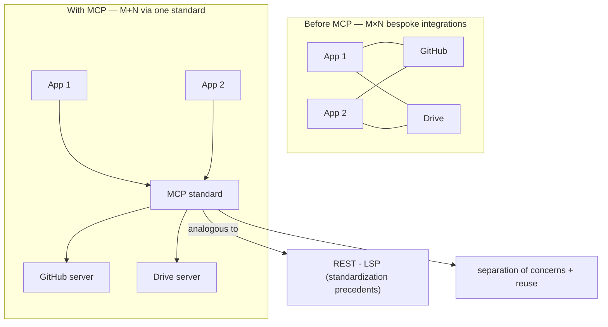

# Lesson 2 — Why MCP

> **One-line:** Without MCP, connecting **M** AI apps to **N** data sources means writing
> **M×N** bespoke integrations; [[mcp]] is the standard plug ("USB-C for AI") that turns
> that into **M+N** — build once, use everywhere.

## Concept map

## Why this lesson exists

[[01-introduction]] said *what* MCP is; this one argues *why you'd bother*. 

The thesis:
**a model is only as good as the context it can reach.** 

The hard part was never tool use
itself — it was the **fragmentation** of wiring every app to every data source by hand.

[[03-mcp-architecture]] then shows the machinery that makes the standard work.

## Key ideas

### The M×N integration problem
Many models/apps × many data sources, each pair needing its own integration, auth, and
data-access logic — rebuilt "over and over and over again." Teams kept **repeating the
wheel**: same data source, different bespoke code per app.

### MCP as the standardizing layer ("USB-C for AI")
MCP doesn't reinvent [[tools|tool use]]; it **standardizes the connection** so you
**build once and use everywhere** (M×N → M+N). Explicit precedents cited:
- **REST** — standardized how web apps talk to back ends.
- **LSP** (Language Server Protocol, Microsoft 2016) — standardized how editors talk to
  language tooling, so an extension isn't rewritten per IDE.

> 🔑 *Everything MCP does, you could do without MCP* — the win is the **shared language**,
> not new capability.

### Decoupling / separation of concerns
MCP **shifts the burden**: 
- You build/use MCP-compatible apps and connect to
[[mcp-server|servers]] for each data need (data stores, CRM like HubSpot/Salesforce,
version control…). 
- Servers are **open-source and reusable** across any
MCP-compatible host.

### Wins by audience
| Audience | Win |
|---|---|
| App developers | Connect to a server with very little work |
| API developers | Build the server **once**, adopt everywhere |
| End users | Bring a server **URL**; data access just appears |
| Enterprises | Clean separation; standalone integrations teams share |

## Mechanics / walkthrough (the demo)
In **Claude Desktop**, connected to a **GitHub** server *and* an **Asana** server: read
issues from GitHub, then triage and assign tickets in Asana — **read from one source,
write to another**, all in natural language, with a **human-in-the-loop** approving
actions. Powered by a lightweight agent (a few MCP tools + a model + a loop).

### Mental model: a server is an API wrapper
Think of an [[mcp-server]] as a **gateway/wrapper on top of an API** — rather than calling
the API directly, you let the server handle it in natural language. Tool use is just *one*
of its capabilities; [[resources]] and [[prompt-templates]] come in [[03-mcp-architecture]].

> [!warning] Staleness
> The demo uses **Claude 3.5 Sonnet**. Conceptually fine, but current models are Claude
> 4.x (e.g. `claude-sonnet-4-6`); the model id matters in later coding lessons, not here.

## Connections
- ⬅ Framed by [[01-introduction]]
- ➡ The architecture that delivers the standard: [[03-mcp-architecture]]
- 📖 [[mcp]] · [[mcp-server]] · [[tools]]

> [!tip] Phone takeaway
> Before MCP: M apps × N data sources = M×N hand-built integrations. MCP is the standard
> plug (like USB-C, like REST/LSP) that makes it M+N — decoupled, reusable, build-once.
