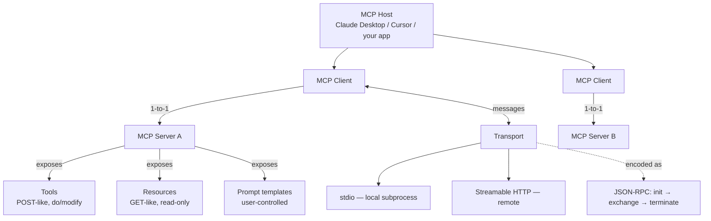

# Lesson 3 — MCP Architecture

> **One-line:** The vocabulary hub — a [[mcp-host]] holds [[mcp-client|clients]] that each
> keep a 1-to-1 link to a [[mcp-server]]; servers expose three primitives ([[tools]],
> [[resources]], [[prompt-templates]]) over a [[transport]], all spoken in [[json-rpc]].

## Concept map

## Why this lesson exists

[[02-why-mcp]] sold the *standard*; this lesson defines the **moving parts** every later
coding lesson assumes. It is the **glossary**: host vs client vs server, the three
server primitives, transports, and the message lifecycle. Learn these names here so the
SDK code in [[05-creating-an-mcp-server]] and [[06-creating-an-mcp-client]] reads cleanly.

## Key ideas

### The three roles → [[mcp-architecture]]
- **[[mcp-host]]** — the LLM application wanting data (Claude Desktop, Cursor, Windsurf,
  your chatbot). It **stores and maintains** the clients.
- **[[mcp-client]]** — lives inside the host; keeps a **1-to-1 connection** to one server.
- **[[mcp-server]]** — a lightweight program that **exposes capabilities** to a client.

> The client's job is to **find** tools/resources; the server's job is to **expose** them.

### The three server primitives
| Primitive | Analogy | Read/Write | Controlled by | Note |
|---|---|---|---|---|
| **[[tools]]** | POST | invoke/modify | model (client invokes) | functions: search, send, update records |
| **[[resources]]** | GET | read-only | app chooses to consume | files, DB records, API responses, PDFs; **dynamic**, can update |
| **[[prompt-templates]]** | — | n/a | **user** | predefined, evaluated prompts; removes prompt-engineering burden |

### [[transport]] — how messages move
You pick a transport based on how you run the app; the message content is identical.
- **[[stdio-transport]]** — **local**: client launches the server as a **subprocess**,
  they read/write over stdin/stdout. The most common local setup.
- **[[streamable-http-transport]]** — **remote**: HTTP GET/POST to an endpoint (e.g.
  `/mcp`), with an optional **server-sent-events** upgrade. Supports both **stateful** and
  **stateless** deployments; the **recommended** remote transport going forward.

### [[json-rpc]] — the message layer & lifecycle
All communication is JSON-RPC **requests / responses / notifications**. Lifecycle:
**initialize** (request → response → `initialized` notification) → **message exchange**
(either side may send requests/notifications; later: server-side **sampling**) →
**terminate**. This is why SDK code shows methods like `initialize`.

## Mechanics / walkthrough (the SQLite demo + SDK preview)

**Demo (Claude Desktop + SQLite server):** all three primitives in action —
- **Tools:** "what tables do I have?" → server returns a `list_tables` tool; client calls
  it (human-in-the-loop approves); Claude then queries and builds an artifact visualization.
- **Prompt template:** an "MCP demo" prompt; the user supplies only **dynamic data** (a
  topic), the server supplies the battle-tested prompt text.
- **Resource:** a business-insight memo that **updates as data changes** — no tool call
  needed to fetch it; the server just sends data, the app chooses to use it.

**Python SDK preview** (decorate-a-function pattern, fleshed out in lessons 5/8):
- **Tool** — decorate a function; args + return type generate the **tool schema**.
- **Resource** — decorate a function bound to a **URI**; optional **MIME type**; can be a
  **templated** URI (like an f-string) for dynamic ids (e.g. `@`-mention docs in a CLI).
- **Prompt** — decorate a function returning a name/description + list of messages/text.

> [!warning] Staleness
> The lesson says "as of recording, Streamable HTTP isn't supported across all SDKs, so
> we'll use **HTTP + SSE**." That's now reversed: standalone **SSE is deprecated** (since
> MCP spec `2025-03-26`) and **Streamable HTTP is the recommended remote transport**. Use
> `mcp.run(transport='streamable-http')` and `streamablehttp_client(url)` — see
> [[10-creating-and-deploying-remote-servers]] and `reports/modernization.md`.

## Connections
- ⬅ Motivated by [[02-why-mcp]]; framed by [[01-introduction]]
- ➡ First hands-on code: [[04-chatbot-example]] → [[05-creating-an-mcp-server]] →
  [[06-creating-an-mcp-client]]
- ➡ Primitives deepened in [[08-adding-prompt-and-resource-features]]; transports in
  [[10-creating-and-deploying-remote-servers]]
- 📖 [[mcp-architecture]] · [[mcp-host]] · [[mcp-client]] · [[mcp-server]] · [[tools]] ·
  [[resources]] · [[prompt-templates]] · [[transport]] · [[json-rpc]]

> [!tip] Phone takeaway
> Host → holds clients → each client 1-to-1 with a server → server exposes **tools**
> (do/POST), **resources** (read/GET), **prompts** (user-picked templates), over a
> **transport** (stdio local, Streamable HTTP remote), all as **JSON-RPC** messages.
