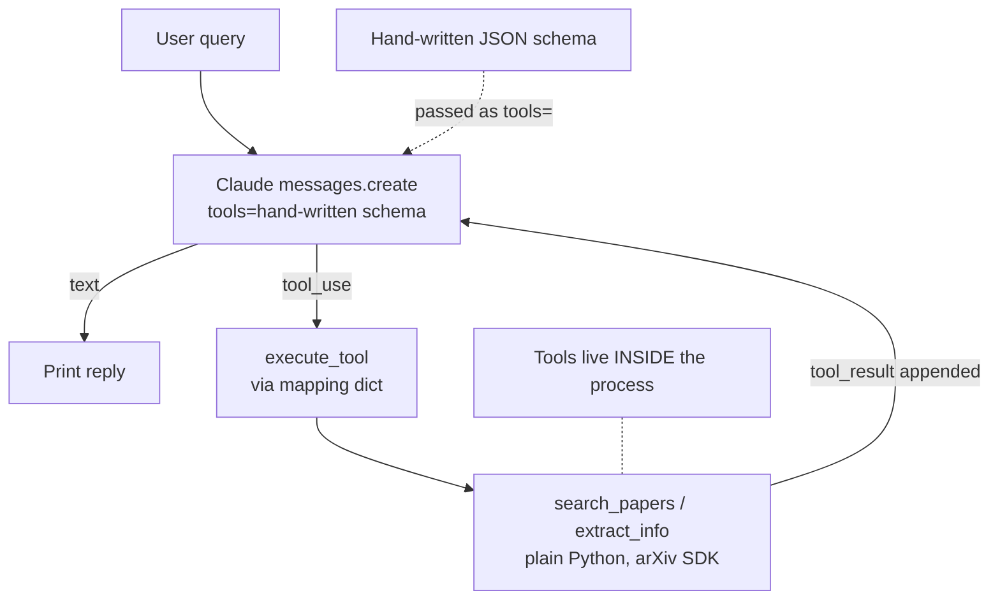

# Lesson 4 — Chatbot Example

> **One-line:** Build a pre-MCP baseline — an Anthropic [[tool-use-loop]] that calls two plain
> Python arXiv functions (`search_papers`, `extract_info`) whose [[tools]] schemas are **hand-written**,
> setting up the exact pain that [[fastmcp]] removes in [[05-creating-an-mcp-server]].

## Concept map



## Why this lesson exists

Before introducing MCP, the course grounds you in the foundation MCP is built on: **LLM tool use**.

Here the tools and the chat loop are **one program** — no protocol, no server. This is the "before"
picture. [[05-creating-an-mcp-server]] takes these *same two functions* and moves them behind a
standard protocol; everything downstream ([[06-creating-an-mcp-client]], the reference servers in
[[07-connecting-the-mcp-chatbot-to-reference-servers]]) exists to undo the coupling you see here.

## Key ideas

### The two domain functions
Plain Python, no MCP in sight (`raw/assignments/L3/L3.ipynb`):
- **`search_papers(topic, max_results=5)`** — queries arXiv, writes `papers/<topic>/papers_info.json`,
  returns a list of paper IDs.
- **`extract_info(paper_id)`** — scans those JSON files, returns the paper's info as a JSON string
  (or a "no saved information" message).

### [[tools]] — declared by hand
Every tool needs a **name**, **description**, and **input schema**. Here that schema is **written
out manually** as JSON Schema:

```python
tools = [{
    "name": "search_papers",
    "description": "Search for papers on arXiv ...",
    "input_schema": {
        "type": "object",
        "properties": {
            "topic": {"type": "string", "description": "The topic to search for"},
            "max_results": {"type": "integer", "default": 5}
        },
        "required": ["topic"]
    }
}, { ... extract_info ... }]
```

> 🔑 Notice the schema **duplicates** the function's own signature and docstring. Keeping them in
> sync by hand is the friction [[fastmcp]] eliminates by *inferring* the schema in the next lesson.

### The [[tool-use-loop]]
The model never runs the functions — **the app does**. `process_query` loops:

1. `client.messages.create(..., tools=tools, messages=messages)`
2. For each content block: 
	1. `text` → print; 
	2. `tool_use` → call `execute_tool(name, args)`.
3. `execute_tool` 
	1. Looks the name up in a `mapping_tool_function` dict, the tool registry
	2. Then calls the real Python function
	3. Finally, normalizes the return (list → joined string, dict → JSON, etc.).
4. Append the `tool_result` as a `user` message, call the model again.
5. Stop when the reply is a single text block.

## Mechanics / walkthrough

- Imports: `arxiv`, `json`, `os`, `typing`, `anthropic`; `PAPER_DIR = "papers"`.
- `mapping_tool_function = {"search_papers": ..., "extract_info": ...}` is the bridge from a
  tool *name* (what Claude returns) to a callable.
- Demo: "hi" (model lists its tools) → "search papers on algebra" (fires `search_papers`) →
  "extract & summarize the first two" (fires `extract_info` per ID).
- **No persistent memory** — each session starts fresh; you must re-pass IDs across turns.

> [!warning] Staleness
> The notebook originally targeted `claude-3-7-sonnet-20250219` (retired-soon). The shipped L3
> code has **already been updated** to `claude-sonnet-4-6` (the old id is left commented as
> `#deprecated model`). Use a current Claude 4.x id. See `reports/modernization.md` #2.

## Connections
- ⬅ Uses the host/tool vocabulary set up in [[03-mcp-architecture]]; motivated by [[02-why-mcp]]
- ➡ The two functions are wrapped as MCP tools in [[05-creating-an-mcp-server]]
- 📖 Concepts: [[tool-use-loop]], [[tools]] (and the contrast target [[fastmcp]])

> [!tip] Phone takeaway
> This is the "before MCP" baseline: tools are plain functions glued to the chat loop, and their
> JSON schemas are typed out by hand. Remember the **tool-use loop** (model proposes → app executes
> → result fed back) — MCP changes *where* tools live, not this loop.
