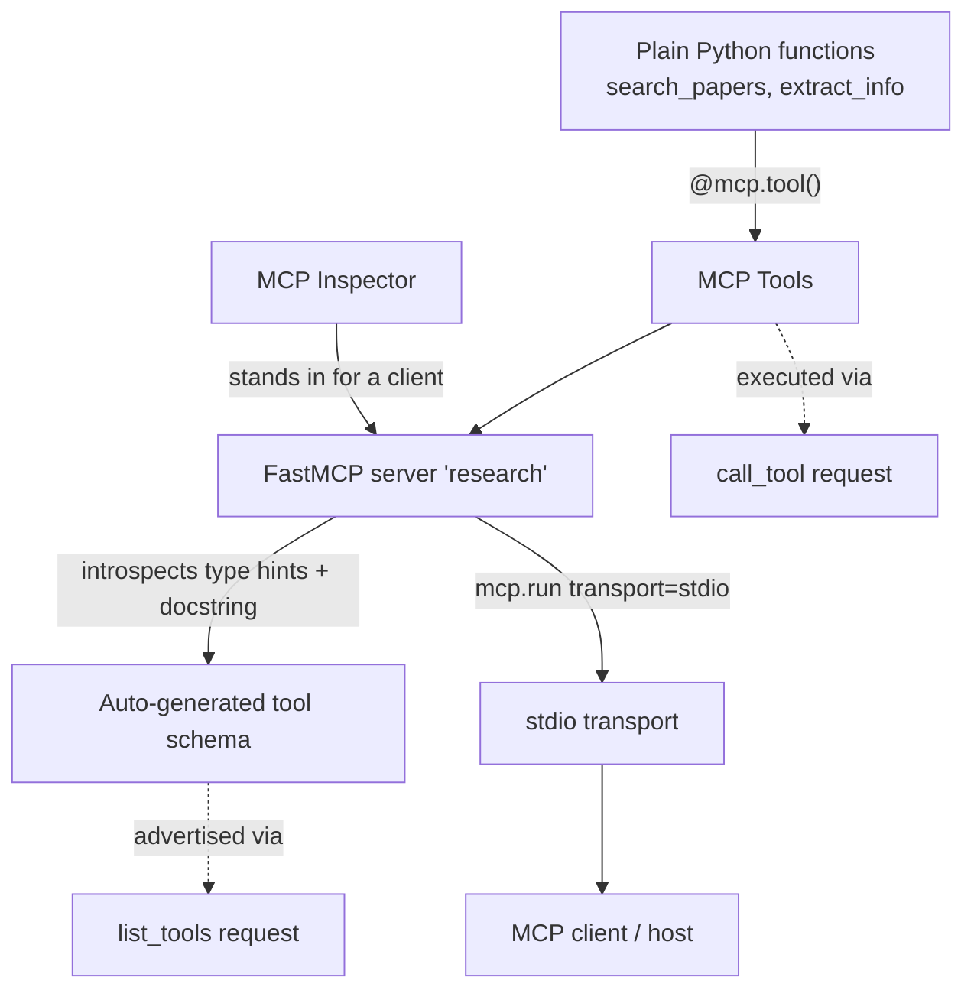

# Lesson 5 — Creating an MCP Server

> **One-line:** Take the two plain Python functions from [[04-chatbot-example]] and expose them
> as MCP **tools** by wrapping them in a `FastMCP` server that speaks the [[stdio-transport]],
> then validate it with the [[mcp-inspector]].

## Concept map



## Why this lesson exists

In [[04-chatbot-example]] the tools lived *inside* the chatbot process — the LLM loop and the
tool implementations were one program. 

MCP's value (see [[02-why-mcp]] and [[03-mcp-architecture]])
is **decoupling**: the tools move behind a standard protocol so *any* MCP-aware host can use them.

This lesson is the first half of that split — building the **server**. [[06-creating-an-mcp-client]]
builds the other half.

## Key entities

### `mcp-server`
A process that exposes some combination of **tools**, **resources**, and **prompt templates** to a
client over a transport. Here it exposes only tools. 

A server handles two core request types for tools:
- **`list_tools`** — "what can you do?" → returns tool names + schemas (`images/server_list_tools.png`)
- **`call_tool`** — "do this one with these args" → executes and returns a result (`images/server_call_tool.png`)

### `FastMCP` — *the high-level path*
The course contrasts **two ways** to build a server:
| Approach | You write | Trade-off |
|---|---|---|
| **Low-level** | Explicit `ListToolsRequest` / `CallToolRequest` handlers | Full control over every protocol detail |
| **`FastMCP`** (used here) | Just the tool *functions* | Framework handles protocol + schema; faster, simpler |

```python
from mcp.server.fastmcp import FastMCP
mcp = FastMCP("research")   # the server's name
```

### `tool-decorator` + `tool-schema-inference`
The pivotal mechanic: 
- `@mcp.tool()` turns a function into an advertised tool, 
- And **`FastMCP` auto-generates the MCP schema from the function's type hints and docstring** — no hand-written JSON schema (which is what the chatbot lesson had to do manually).

```python
@mcp.tool()
def search_papers(topic: str, max_results: int = 5) -> List[str]:
    """Search for papers on arXiv based on a topic and store their information.

    Args:
        topic: The topic to search for
        max_results: Maximum number of results to retrieve (default: 5)
    Returns:
        List of paper IDs found in the search
    """
```
- `topic: str`, `max_results: int = 5` → parameter schema (types, defaults, required-ness)
- the docstring → the tool description + per-arg descriptions the LLM reads to decide *when/how* to call it

> 🔑 **Takeaway:** in MCP-via-FastMCP, **good type hints and docstrings *are* your API contract.**
> This is exactly the seam the future coding assignment will test.

### `stdio-transport`
The server is launched as a subprocess and communicates over standard input/output:
```python
if __name__ == "__main__":
    mcp.run(transport='stdio')
```
Used for **local** servers (this lesson). 

The *same* server is later re-pointed at an **HTTP transport** for remote deployment in [[10-creating-and-deploying-remote-servers]] — only this one line changes.

### `mcp-inspector`
A standalone debugging client (run via `npx @modelcontextprotocol/inspector`) used to manually
exercise `list_tools` / `call_tool` without writing a client yet. 

It stands in for [[06-creating-an-mcp-client]] so you can verify the server in isolation.

## The build/run loop (notebook procedure)

1. `%%writefile mcp_project/research_server.py` — the notebook *saves* the cell to disk rather than
   executing it (the server runs from a terminal, not in-kernel).
2. Environment via **`uv`**: `uv init` → `uv venv` → `source .venv/bin/activate` → `uv add mcp arxiv`
3. Launch under the inspector: `npx @modelcontextprotocol/inspector uv run research_server.py`
4. In the Inspector UI: command=`uv`, args=`run research_server.py`, set the proxy address, then
   click **List Tools** → **Run** a tool.

## The two tools (domain logic, unchanged from L4)

- **`search_papers(topic, max_results=5)`** — queries arXiv, writes
  `papers/<topic>/papers_info.json`, returns the list of paper IDs.
- **`extract_info(paper_id)`** — scans those JSON files for a paper ID, returns its info as a JSON
  string (or a "not found" message).

The arXiv logic is *incidental*; the lesson's real subject is the **wrapping** (`@mcp.tool`, `FastMCP`,
transport). 

That separation is what makes this a clean assignment target.

## Connections
- ⬅ Tools came from [[04-chatbot-example]] (manual schema → now inferred)
- ➡ Consumed by [[06-creating-an-mcp-client]]; integrated with multiple servers in [[07-connecting-the-mcp-chatbot-to-reference-servers]]
- 🔁 Same server, HTTP transport, in [[10-creating-and-deploying-remote-servers]]
- 📖 Vocabulary defined in [[03-mcp-architecture]]

## Open seam for the coding assignment (faithful-extraction note)
The notebook *hands you* the finished `research_server.py`. The natural assignment inversion:
give the student the **docstring + signature contract** and the inspector test, and have them
implement the tool bodies — graded by driving `list_tools`/`call_tool` programmatically.
(Design deferred per "faithful extraction first.")
