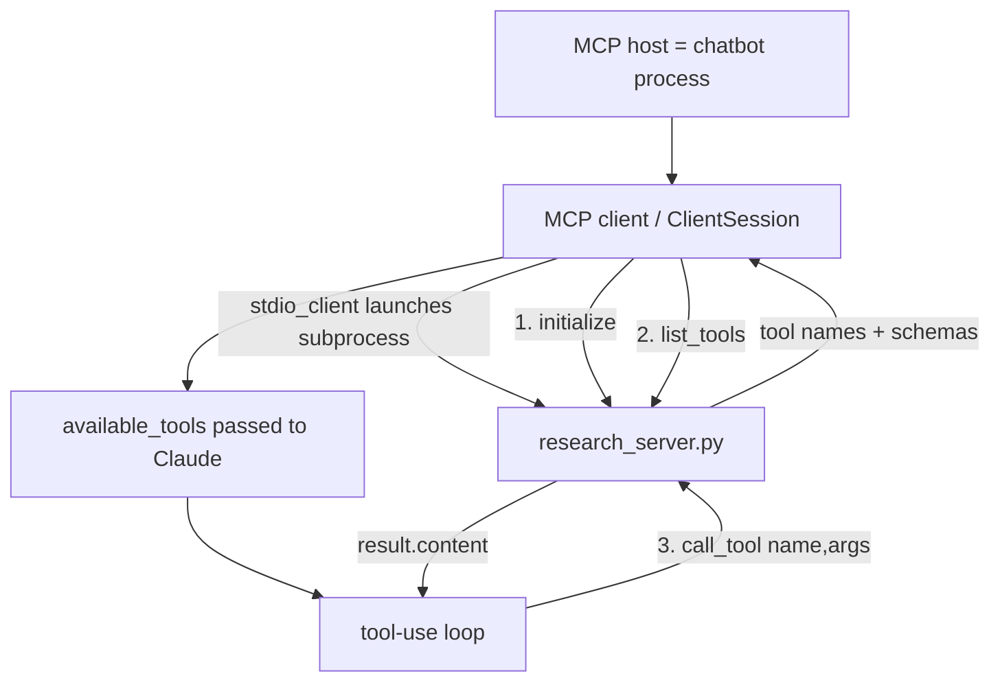

# Lesson 6 — Creating an MCP Client

> **One-line:** Replace the [[mcp-inspector]] with your own [[mcp-client]] inside the chatbot: open a
> `ClientSession` over a `stdio_client` connection to the Lesson-5 server, run
> `initialize → list_tools → call_tool`, and feed results back through the same [[tool-use-loop]].

## Concept map



## Why this lesson exists

[[05-creating-an-mcp-server]] built the server and tested it by hand with the [[mcp-inspector]].

This lesson builds the **other half of the split** introduced in [[03-mcp-architecture]]: a real
[[mcp-client]] living inside a [[mcp-host]] (the chatbot). 

The chat loop from [[04-chatbot-example]]
returns almost unchanged — the only difference is *where tool results come from*: 
- A server over a transport
- Instead of a local function call.

## Key ideas

### [[mcp-client]] inside a [[mcp-host]]
The host is the app the user talks to (the chatbot); the client is the component inside it that
holds **one connection to one server**. 

The course flags this code as deliberately *lower-level* —
you rarely hand-write clients, but it shows what Claude Desktop / Cursor do under the hood.

### Crucially: **no tools are defined here**
Compare with [[04-chatbot-example]], which hard-coded a `tools` list. Now the client *asks the
server* what tools exist. The client's job is to **query for tools and hand them to the LLM**.

### The connection lifecycle (the heart of the lesson)
From `raw/assignments/L5/mcp_project/mcp_chatbot.py`:

```python
server_params = StdioServerParameters(
    command="uv", args=["run", "research_server.py"], env=None,
)
async with stdio_client(server_params) as (read, write):     # launch server as subprocess
    async with ClientSession(read, write) as session:
        await session.initialize()                            # 1. handshake
        response = await session.list_tools()                 # 2. discover tools
        self.available_tools = [{
            "name": tool.name,
            "description": tool.description,
            "input_schema": tool.inputSchema,                 # schema came from FastMCP inference
        } for tool in response.tools]
```

- `stdio_client` gives a `(read, write)` stream pair — the [[stdio-transport]].
- `ClientSession` is the high-level wrapper exposing `initialize`, `list_tools`, `call_tool`.
- The tool dicts are reshaped into exactly the Anthropic `tools=` format from Lesson 4 — so the
  LLM side is identical; only the **source** of the schema changed (server-provided, FastMCP-inferred).

### Same [[tool-use-loop]], remote execution
In `process_query`, the one changed line is how a tool runs:

```python
# Lesson 4:  result = execute_tool(tool_name, tool_args)
result = await self.session.call_tool(tool_name, arguments=tool_args)   # 3. call over MCP
```

The server invokes the tool and returns `result.content`, appended as a `tool_result`.

## Mechanics / walkthrough

1. `__init__` starts with **no session and no tools** — both filled in once connected.
2. `connect_to_server_and_run` opens `stdio_client` → `ClientSession` as nested async context
   managers, runs the lifecycle above, then enters `chat_loop`.
3. Everything is `async` (`asyncio.run(main())`); `call_tool` and `list_tools` are awaited.
4. Run it: `cd` into the project, `source .venv/bin/activate`, then `uv run mcp_chatbot.py`.
   On startup you'll see the `list_tools` request fire; querying ("search physics, 2 papers")
   fires a `call_tool` request to the server.

> [!warning] Staleness
> This client uses the **sync `Anthropic` client + `nest_asyncio.apply()` hack** inside async code,
> the **retired model id** `claude-3-7-sonnet-20250219`, and ships a junk `typing` PyPI pin. 
> 
> Modern Fix: use `AsyncAnthropic` + `await self.anthropic.messages.create(...)`, drop `nest_asyncio`, switch
> to `claude-sonnet-4-6`, and remove the `typing` dependency. 
> 
> See `reports/modernization.md` #2, #5, #6.

## Connections
- ⬅ Connects to the server from [[05-creating-an-mcp-server]]; reuses the loop from [[04-chatbot-example]]
- ➡ Generalized to **many servers via config** in [[07-connecting-the-mcp-chatbot-to-reference-servers]]
- 📖 Vocabulary: [[mcp-client]], [[mcp-host]], [[stdio-transport]] (replaces the [[mcp-inspector]])

> [!tip] Phone takeaway
> A client is just: launch the server over **stdio**, then `initialize → list_tools → call_tool`
> through a `ClientSession`. Tools are now **discovered from the server**, not hard-coded — but the
> tool-use loop driving Claude is the same one from Lesson 4.
