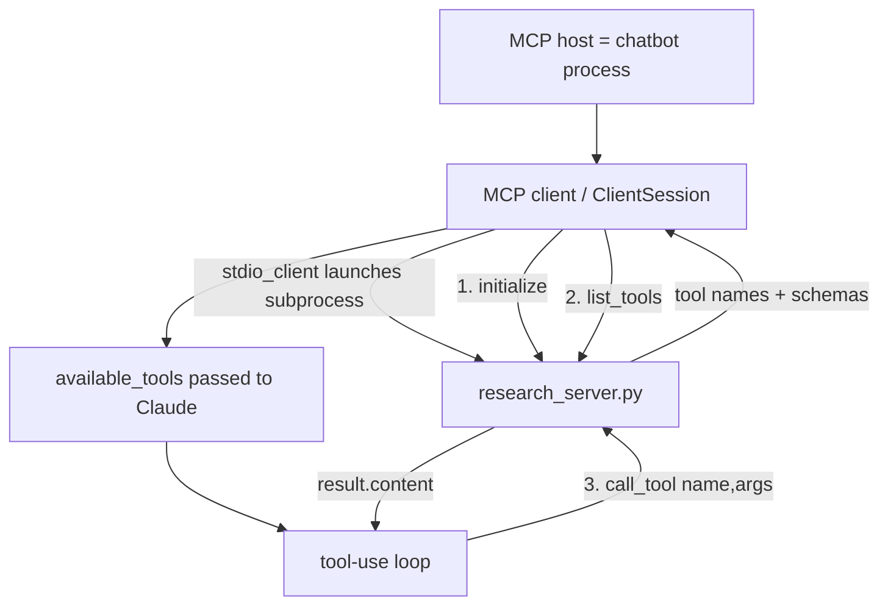

# Lesson 6 — Creating an MCP Client

> **One-line:** Replace the [[mcp-inspector]] with your own [[mcp-client]] inside the chatbot: open a
> `ClientSession` over a `stdio_client` connection to the Lesson-5 server, run
> `initialize → list_tools → call_tool`, and feed results back through the same [[tool-use-loop]].

## Concept map



## Why this lesson exists

[[05-creating-an-mcp-server]] built the server and tested it by hand with the [[mcp-inspector]].

This lesson builds the **other half of the split** introduced in [[03-mcp-architecture]]: a real
[[mcp-client]] living inside a [[mcp-host]] (the chatbot). 

The chat loop from [[04-chatbot-example]]
returns almost unchanged — the only difference is *where tool results come from*: 
- A server over a transport
- Instead of a local function call.

## Key ideas

### [[mcp-client]] inside a [[mcp-host]]
The host is the app the user talks to (the chatbot); the client is the component inside it that
holds **one connection to one server**. 

The course flags this code as deliberately *lower-level* —
you rarely hand-write clients, but it shows what Claude Desktop / Cursor do under the hood.

### Crucially: **no tools are defined here**
Compare with [[04-chatbot-example]], which hard-coded a `tools` list. Now the client *asks the
server* what tools exist. The client's job is to **query for tools and hand them to the LLM**.

### The connection lifecycle (the heart of the lesson)
From `raw/assignments/L5/mcp_project/mcp_chatbot.py`:

```python
server_params = StdioServerParameters(
    command="uv", args=["run", "research_server.py"], env=None,
)
async with stdio_client(server_params) as (read, write):     # launch server as subprocess
    async with ClientSession(read, write) as session:
        await session.initialize()                            # 1. handshake + capability negotiation
        response = await session.list_tools()                 # 2. returns ListToolsResult wrapper
        self.available_tools = [{
            "name": tool.name,
            "description": tool.description,
            "input_schema": tool.inputSchema,                 # camelCase → snake_case; schema from FastMCP
        } for tool in response.tools]                        # iterate .tools — NOT response itself
```

The course shows tools only. A production host also calls `list_resources()`,
`list_resource_templates()`, and `list_prompts()` — each returning its own wrapper (`ListResourcesResult`,
etc.) — and **gates every call on `initialize()`'s capability flags** so bare servers don't abort the
connect.

> Full details — wrapper types, capability-gating, `try/except` pattern, routing registries,
> `inputSchema` → `input_schema` reshape, and resources/prompts registration:
> **[[mcp-session-init]]**

### Same [[tool-use-loop]], remote execution
In `process_query`, the one changed line is how a tool runs:

```python
# Lesson 4:  result = execute_tool(tool_name, tool_args)
result = await self.session.call_tool(tool_name, arguments=tool_args)   # 3. call over MCP
```

The server invokes the tool; `result` is a `CallToolResult` (`.content` list, `.isError` flag).
The host appends a `tool_result` block and calls the model again until `stop_reason != "tool_use"`.

> MCP's `CallToolResult` schema (`.content`, `.structuredContent`, `.isError`): **[[mcp-tool-result]]**  
> Anthropic `tool_use` / `tool_result` message shapes + the full agentic loop: **[[anthropic-tool-use-schema]]**

## Mechanics / walkthrough

1. `__init__` starts with **no session and no tools** — both filled in once connected.
2. `connect_to_server_and_run` opens `stdio_client` → `ClientSession` as nested async context
   managers, runs the lifecycle above, then enters `chat_loop`.
3. Everything is `async` (`asyncio.run(main())`); `call_tool` and `list_tools` are awaited.
4. Run it: `cd` into the project, `source .venv/bin/activate`, then `uv run mcp_chatbot.py`.
   On startup you'll see the `list_tools` request fire; querying ("search physics, 2 papers")
   fires a `call_tool` request to the server.

> [!warning] Staleness
> This client uses the **sync `Anthropic` client + `nest_asyncio.apply()` hack** inside async code,
> the **retired model id** `claude-3-7-sonnet-20250219`, and ships a junk `typing` PyPI pin. 
> 
> Modern Fix: use `AsyncAnthropic` + `await self.anthropic.messages.create(...)`, drop `nest_asyncio`, switch
> to `claude-sonnet-4-6`, and remove the `typing` dependency. 
> 
> See `reports/modernization.md` #2, #5, #6.

## Connections
- ⬅ Connects to the server from [[05-creating-an-mcp-server]]; reuses the loop from [[04-chatbot-example]]
- ➡ Generalized to **many servers via config** in [[07-connecting-the-mcp-chatbot-to-reference-servers]]
- 📖 Vocabulary: [[mcp-client]], [[mcp-host]], [[stdio-transport]] (replaces [[mcp-inspector]])
- 🧩 **Session init & primitive registration** (the full connect/discover/route pattern): [[mcp-session-init]]
- 🔧 **Tool dispatch** — MCP result schema: [[mcp-tool-result]]; Anthropic message shapes: [[anthropic-tool-use-schema]]; agentic loop: [[tool-use-loop]]
- 📂 **Resource access** — select/resolve/read/inject flow: [[mcp-resource-access]]; `ReadResourceResult` schema: [[mcp-resource-result]]
- 💬 **Prompt access** — discover/invoke/run flow: [[mcp-prompt-access]]; `GetPromptResult` schema: [[mcp-prompt-result]]
- 🎛️ **Why tool/resource/prompt surface differently** in a real host: [[mcp-control-model]]
- ⚠️ SDK gotchas (base URL, `tool_choice`, tool-name regex): [[openai-to-anthropic-migration]]

> [!tip] Phone takeaway
> A client is: launch subprocess over **stdio** → `initialize` (capability handshake) →
> `list_tools / list_resources / list_prompts` (each returns a *wrapper*, iterate its attribute) →
> build routing registries → `call_tool / read_resource / get_prompt` on dispatch.
> The [[tool-use-loop]] driving Claude is unchanged from Lesson 4 — only *how results are fetched* changes.
