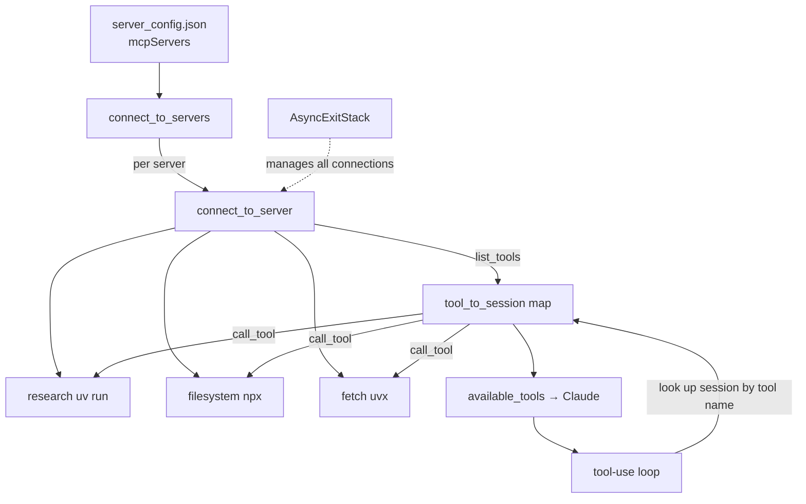

# Lesson 7 — Connecting the MCP Chatbot to Reference Servers

> **One-line:** Generalize the single-server client into one chatbot that connects to **many**
> [[mcp-server]]s declared in a `server_config.json` — your `research` server plus open-source
> **reference servers** (`filesystem`, `fetch`) — and routes each tool call to the right session.

## Concept map



## Why this lesson exists

[[06-creating-an-mcp-client]] connected **one** client to **one** server. 

MCP's real payoff is the
**ecosystem**: any data source you can imagine probably already has a server. 

This lesson swaps
hard-coded `StdioServerParameters` for a **config file**, connects to several servers at once, and
shows that the host doesn't care whether a server is yours or someone else's — it's all the same
protocol. 

This is exactly how Claude Desktop, Cursor, and Windsurf load servers
(see [[09-configuring-servers-for-claude-desktop]]).

## Key ideas

### Reference servers — don't build, just point at them
Anthropic publishes reference servers; the source "looks familiar" because they're built the same way
you built yours. Two used here:
- **`fetch`** — retrieves web pages, converts HTML → markdown for LLM consumption. Written in Python,
  so it runs via **`uvx mcp-server-fetch`** (downloads + runs on the fly; `uvx`, not `uv run`).
- **`filesystem`** — read/write/search files and metadata. Written in **TypeScript**, so it runs via
  **`npx -y @modelcontextprotocol/server-filesystem .`** — the trailing `.` scopes it to the current directory (it can't touch files outside it).

> 🔑 The launch command encodes the server's language/runtime: `uv run` (your local Python),
> `uvx` (a published Python server), `npx` (a published Node/TypeScript server).

### `server_config.json` — connections as data
Servers move out of code into config (`raw/assignments/L6/mcp_project/server_config.json`):

```json
{
  "mcpServers": {
    "filesystem": { "command": "npx", "args": ["-y", "@modelcontextprotocol/server-filesystem", "."] },
    "research":   { "command": "uv",  "args": ["run", "research_server.py"] },
    "fetch":      { "command": "uvx", "args": ["mcp-server-fetch"] }
  }
}
```
Each entry maps cleanly onto `StdioServerParameters(**server_config)` — every server here still
speaks [[stdio-transport]]. This is the **same schema Claude Desktop uses** in
[[09-configuring-servers-for-claude-desktop]].

### Many sessions, one tool→session map
The chatbot now keeps several sessions and must remember **which server owns which tool**
(`raw/assignments/L6/mcp_project/mcp_chatbot.py`):

```python
self.sessions: List[ClientSession] = []
self.exit_stack = AsyncExitStack()                 # manages all connections at once
self.tool_to_session: Dict[str, ClientSession] = {}
```

`connect_to_server` runs the familiar `initialize → list_tools` per server and records
`tool_to_session[tool.name] = session` for each tool, while appending its schema to
`available_tools`. `connect_to_servers` reads the JSON, iterates `mcpServers`, and calls it for each.

### Routing in the [[tool-use-loop]]
The loop is unchanged except the tool call now **looks up the owning session first**:

```python
session = self.tool_to_session[tool_name]          # which server has this tool?
result = await session.call_tool(tool_name, arguments=tool_args)
```

### `AsyncExitStack` replaces nested `with`
With many context managers across servers, the single-server `async with ... async with ...` nesting
doesn't scale. Each connection is entered via `exit_stack.enter_async_context(...)`, and one
`await self.exit_stack.aclose()` in `cleanup()` (called from a `finally`) tears them all down.

## Mechanics / walkthrough

1. `connect_to_servers()` → loop over config → `connect_to_server(name, cfg)` for each.
2. `chat_loop()` runs as before; `process_query` routes via `tool_to_session`.
3. `main()` wraps `connect_to_servers()` + `chat_loop()` in `try/finally` with `cleanup()`.
4. Run: `cd mcp_project`, `source .venv/bin/activate`, `uv run mcp_chatbot.py`. On startup it prints
   one "Connected to ... with tools" line per server.
5. Demo prompts chain servers: *fetch* a page → *research* arXiv papers → *filesystem* writes results
   to a file. (One demo shows the model confusing the **MCP** acronym — a prompt-engineering nudge.)

> [!warning] Staleness
> Same client-side rot as Lesson 6: sync `Anthropic` + `nest_asyncio` (here `nest_asyncio` is dropped
> but the client is still sync inside async code), retired `claude-3-7-sonnet-20250219`, and a junk
> `typing` pin. Modern fix: `AsyncAnthropic` + `await`, `claude-sonnet-4-6`, remove `typing`.
> See `reports/modernization.md` #2, #5, #6. The multi-server config pattern itself is fully current.

## Connections
- ⬅ Generalizes the single client of [[06-creating-an-mcp-client]]; servers built per [[05-creating-an-mcp-server]]
- ➡ The same config file feeds Claude Desktop in [[09-configuring-servers-for-claude-desktop]];
  next, servers expose [[resources]] + [[prompt-templates]] in [[08-adding-prompt-and-resource-features]]
- 📖 Vocabulary: [[mcp-client]], [[mcp-server]], [[stdio-transport]], [[tool-use-loop]]

> [!tip] Phone takeaway
> One chatbot, many servers: list them in `server_config.json`, connect to each, and keep a
> **tool→session map** so each `call_tool` reaches the right server. Adding any reference server is
> just a few lines of config — that's the whole MCP ecosystem pitch.
