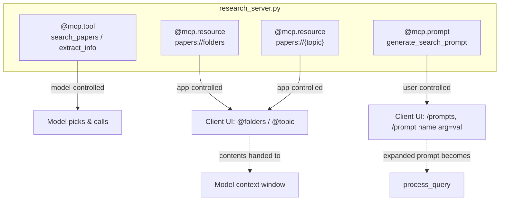

# Lesson 8 — Adding Prompt and Resource Features

> **One-line:** Round out the research server with the other two MCP primitives —
> [[resources]] (`@mcp.resource`, read-only data via URIs) and [[prompt-templates]]
> (`@mcp.prompt`, user-controlled parameterized prompts) — then teach the chatbot to consume them.

## Concept map



## Why this lesson exists

[[05-creating-an-mcp-server]] exposed only [[tools]]; [[07-connecting-the-mcp-chatbot-to-reference-servers]] connected to several servers. 

MCP has **three** server-side primitives, and the distinction is about *who is in control*. 

This lesson adds the other two and shows that the client's **presentation is
entirely the developer's choice** — MCP only moves data, it does not mandate a UI.

## The three primitives — who controls each

| Primitive | Decorator | Controlled by | Analogy |
|---|---|---|---|
| [[tools]] | `@mcp.tool()` | **Model** — LLM decides when to call | function call / `POST` |
| [[resources]] | `@mcp.resource(uri)` | **Application** — host chooses to fetch | `GET` (read-only data) |
| [[prompt-templates]] | `@mcp.prompt()` | **User** — invokes a canned prompt | saved query / macro |

> 🔑 **Takeaway:** the primitive you pick is a question of *control*, not capability.
> Don't build a tool for read-only data the app should just pull — make it a resource.

## Key ideas

### `resources` — read-only data behind a URI
Instead of a tool that fetches from the filesystem, expose the data as a resource. Real code from
`raw/assignments/L7/mcp_project/research_server.py`:

```python
@mcp.resource("papers://folders")          # static URI → list topic folders
def get_available_folders() -> str: ...

@mcp.resource("papers://{topic}")           # templated URI → papers for one topic
def get_topic_papers(topic: str) -> str: ...
```
The function body does string manipulation + file reads (with not-found handling) and returns
**markdown text**. Resources update **dynamically**: search a new topic via a tool, and the
`papers://{topic}` resource immediately reflects it.

### `prompt-templates` — user-controlled prompt engineering
The server ships a "battle-tested" prompt so the user doesn't have to engineer one:

```python
@mcp.prompt()
def generate_search_prompt(topic: str, num_papers: int = 5) -> str:
    """Generate a prompt for Claude to find and discuss academic papers on a specific topic."""
    return f"""Search for {num_papers} academic papers about '{topic}' ..."""
```
`topic` is required, `num_papers` optional (it has a default). The user supplies arguments; the
**server returns the fully expanded prompt** the client then runs as a query.

## Mechanics / walkthrough (client side)

The chatbot stores `available_prompts` + tool list + resource URIs, and in `connect_to_server`
calls `list_tools`, **`list_prompts`**, and **`list_resources`** on each session — wrapped in
try/except since not every server provides all three. New UI conventions in the chat loop (pure
string parsing, the developer's choice):

- `@folders` → read the `papers://folders` resource; `@<topic>` → read `papers://{topic}`.
- `/prompts` → list available prompts and their args.
- `/prompt <name> <arg>=<value> ...` → fetch + execute the prompt, parsing `key=value` pairs.

Run it from the **L7** folder: `uv run mcp_chatbot.py`. The reference `fetch` server also turns
out to expose a prompt (fetch a URL → markdown), showing prompts/resources are a server-wide pattern.

> [!warning] Staleness
> No transport or API rot here — `@mcp.resource` / `@mcp.prompt` are stable in the current
> `mcp` SDK. (The client elsewhere in this folder still uses the aging `claude-3-7-sonnet`
> id and a `nest_asyncio` hack; see [[06-creating-an-mcp-client]] / `reports/modernization.md`.)

## Connections
- ⬅ Extends the tools-only server from [[05-creating-an-mcp-server]] and the multi-server client from [[07-connecting-the-mcp-chatbot-to-reference-servers]]
- ➡ A real host ([[09-configuring-servers-for-claude-desktop]]) renders these same primitives with no client code
- 📖 [[resources]] · [[prompt-templates]] · [[tools]] · vocabulary in [[03-mcp-architecture]]

> [!tip] Phone takeaway
> Three server primitives, three controllers: **tools = model**, **resources = app**,
> **prompts = user**. Same `@mcp.<x>` decorator pattern; the client picks how to present them.
