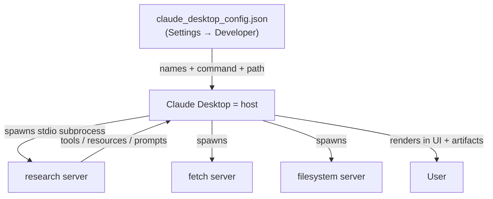

# Lesson 9 — Configuring Servers for Claude Desktop

> **One-line:** Drop the hand-written client entirely — point **Claude Desktop**, a real
> [[mcp-host]], at your research server through its [[claude-desktop-config]] JSON file and let
> the product handle all the low-level wiring.

## Concept map



## Why this lesson exists

The chatbot you built ([[06-creating-an-mcp-client]], [[07-connecting-the-mcp-chatbot-to-reference-servers]])
proved the protocol but required "a bit low level" code. The payoff of MCP being a **standard** is that
*any* compliant host can consume your server. Claude Desktop is one such host — you supply only a config
file, and all the client/subprocess machinery is abstracted away.

## Key ideas

### Same idea, no client code
The [[claude-desktop-config]] is the product-grade twin of the `server_config.json` from the prior
lessons: same "multiple clients connecting to multiple servers" model, but Desktop *is* the client.
You still describe each server by name + the command to start it.

```jsonc
{
  "mcpServers": {
    "research": {
      "command": "uv",
      "args": ["--directory", "/ABSOLUTE/PATH/mcp_project", "run", "research_server.py"]
    },
    "fetch":      { "command": "uvx",  "args": ["mcp-server-fetch"] },
    "filesystem": { "command": "npx",  "args": ["-y", "@modelcontextprotocol/server-filesystem", "/path"] }
  }
}
```

> 🔑 **Takeaway:** for a local [[stdio-transport]] server you must give the **absolute file path** —
> Desktop spawns the subprocess itself, so it can't rely on your shell's working directory.

### Setup is the familiar uv flow — minus the run
`uv init` → `uv venv` → activate → `uv add arxiv mcp`. You install dependencies **but don't run the
server**; Claude Desktop launches it for you. After editing the config you must **quit and reopen**
Desktop to establish connections.

### MCP is an ecosystem, not one app
Once connected, Desktop's UI shows the research server's **tools, resources, and prompts** alongside
`fetch` and `filesystem` — and how they're presented is entirely Desktop's design choice. The MCP docs
list a wide range of compatible hosts (IDEs, CLIs, web and agentic apps); the same server works in all.

## Mechanics / walkthrough

1. Prepare the project (`uv` env + `arxiv`, `mcp`) in the desktop `mcp_project` folder.
2. Claude Desktop → **Settings → Developer → Edit Config** → paste the `mcpServers` block, using the
   absolute path for `research`.
3. Quit + reopen Desktop; verify the server, its tools, resource, and prompts appear.
4. Demo: one prompt chains servers — `fetch` DeepLearning.AI → `search_papers` on the research server →
   the **artifacts** feature builds a flashcard quiz from the findings.

## Doing it yourself in Claude Code (CLI host) — no Desktop required

On Linux there's no Claude Desktop, but **Claude Code is itself an MCP host** — the same role,
a different surface. The same servers from your `server_config.json` register via the
`claude mcp` CLI instead of a JSON file edited in a GUI.

> [!note] The same absolute-path lesson, one level deeper
> Desktop needed the absolute *file* path because it spawns the subprocess. Claude Code needs the
> absolute *interpreter* path for the same reason: bare `python` resolves to base conda (no
> `mcp_research`), so point `research` at the **venv** python. `npx`/`uvx` are already on `PATH`,
> so they can stay bare.

```bash
# research — MUST use the venv python that has mcp_research installed
claude mcp add research -- \
  /home/gyao/Workspace/DLAI--MCP-by-Anthropic/solutions/mcp-research-assistant/starter/.venv/bin/python \
  -m mcp_research server

# filesystem — serves Claude Code's cwd (the repo root); swap "." for an abs path to scope it
claude mcp add filesystem -- npx -y @modelcontextprotocol/server-filesystem .

# fetch
claude mcp add fetch -- uvx mcp-server-fetch
```

- The **`--`** separates Claude's own flags from the subprocess command, so `-m` reaches python.
- `-m mcp_research` works from any cwd because it's an *editable* install in that venv.

### Scope: where the config is written

`claude mcp add` takes `-s/--scope`:

| scope | stored in | committed? | use when |
|---|---|---|---|
| `local` (default) | per-project block in `~/.claude.json` | no | **here** — the venv path is machine-specific |
| `project` | `.mcp.json` at the repo root | yes | portable configs you want to share (use `${VAR}` for paths) |
| `user` | global user config | no | a server you want in every project |

Local is right for this assignment (absolute paths don't travel). `claude mcp list` / `claude mcp get research` inspect them; `claude mcp remove <name>` undoes it.

### Connect, then probe

MCP servers load at **startup**, so **restart the Claude Code session** after adding (then `/mcp`
shows status + each server's tools/resources/prompts). First connect for `filesystem`/`fetch` pulls
their packages via `npx -y` / `uvx`, so allow a few seconds; if either won't spawn, substitute the
absolute `npx`/`uvx` paths.

The payoff: the three primitives you built surface as the **real Claude Code affordances** — a live
demonstration of [[mcp-control-model]] (control model → UX surface):

| your primitive | appears in Claude Code as |
|---|---|
| [[tools]] | `mcp__research__search_papers`, `mcp__fetch__fetch`, … (model-invoked, gated by approval) |
| [[resources]] | `@`-mentionable (`papers://folders`, `papers://{topic}`) |
| [[prompt-templates]] | the slash command **`/mcp__research__generate_search_prompt`** |

That last row is the punchline: Claude Code's own `/mcp__<server>__<prompt>` naming is the very `__`
delimiter you reverse-engineered for the Anthropic tool-name regex — your server, surfaced verbatim
in a production host.

> [!warning] Staleness
> Nothing in this lesson has rotted — it's host configuration, not SDK code. (The research server it
> points at is the stable stdio version from [[08-adding-prompt-and-resource-features]].) The Claude
> Code CLI section above is the modern, Desktop-free path for this repo's Linux environment.

## Connections
- ⬅ Replaces the manual client of [[06-creating-an-mcp-client]]; reuses the config idea from [[07-connecting-the-mcp-chatbot-to-reference-servers]]
- ➡ Next, make the server reachable beyond one machine: [[10-creating-and-deploying-remote-servers]]
- 🖥️ Same idea, Desktop-free: the **Claude Code CLI** host via `claude mcp add` (section above); what the primitives surface as is [[mcp-control-model]]
- 📖 [[claude-desktop-config]] · [[mcp-host]] · [[stdio-transport]]

> [!tip] Phone takeaway
> A real host like Claude Desktop consumes your server with **just a JSON config** — name + command +
> absolute path. No client code; restart Desktop to connect. On Linux, do the same with the **Claude
> Code CLI**: `claude mcp add research -- <venv-python> -m mcp_research server`, restart, then `/mcp`.
