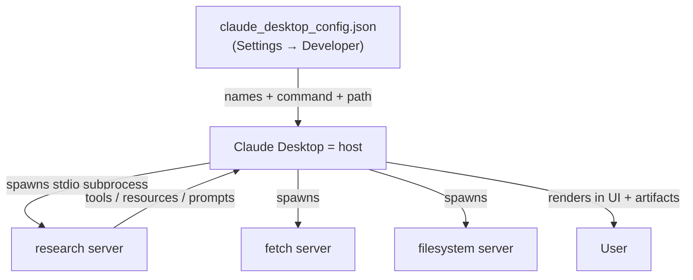

# Lesson 9 — Configuring Servers for Claude Desktop

> **One-line:** Drop the hand-written client entirely — point **Claude Desktop**, a real
> [[mcp-host]], at your research server through its [[claude-desktop-config]] JSON file and let
> the product handle all the low-level wiring.

## Concept map



## Why this lesson exists

The chatbot you built ([[06-creating-an-mcp-client]], [[07-connecting-the-mcp-chatbot-to-reference-servers]])
proved the protocol but required "a bit low level" code. The payoff of MCP being a **standard** is that
*any* compliant host can consume your server. Claude Desktop is one such host — you supply only a config
file, and all the client/subprocess machinery is abstracted away.

## Key ideas

### Same idea, no client code
The [[claude-desktop-config]] is the product-grade twin of the `server_config.json` from the prior
lessons: same "multiple clients connecting to multiple servers" model, but Desktop *is* the client.
You still describe each server by name + the command to start it.

```jsonc
{
  "mcpServers": {
    "research": {
      "command": "uv",
      "args": ["--directory", "/ABSOLUTE/PATH/mcp_project", "run", "research_server.py"]
    },
    "fetch":      { "command": "uvx",  "args": ["mcp-server-fetch"] },
    "filesystem": { "command": "npx",  "args": ["-y", "@modelcontextprotocol/server-filesystem", "/path"] }
  }
}
```

> 🔑 **Takeaway:** for a local [[stdio-transport]] server you must give the **absolute file path** —
> Desktop spawns the subprocess itself, so it can't rely on your shell's working directory.

### Setup is the familiar uv flow — minus the run
`uv init` → `uv venv` → activate → `uv add arxiv mcp`. You install dependencies **but don't run the
server**; Claude Desktop launches it for you. After editing the config you must **quit and reopen**
Desktop to establish connections.

### MCP is an ecosystem, not one app
Once connected, Desktop's UI shows the research server's **tools, resources, and prompts** alongside
`fetch` and `filesystem` — and how they're presented is entirely Desktop's design choice. The MCP docs
list a wide range of compatible hosts (IDEs, CLIs, web and agentic apps); the same server works in all.

## Mechanics / walkthrough

1. Prepare the project (`uv` env + `arxiv`, `mcp`) in the desktop `mcp_project` folder.
2. Claude Desktop → **Settings → Developer → Edit Config** → paste the `mcpServers` block, using the
   absolute path for `research`.
3. Quit + reopen Desktop; verify the server, its tools, resource, and prompts appear.
4. Demo: one prompt chains servers — `fetch` DeepLearning.AI → `search_papers` on the research server →
   the **artifacts** feature builds a flashcard quiz from the findings.

> [!warning] Staleness
> Nothing in this lesson has rotted — it's host configuration, not SDK code. (The research server it
> points at is the stable stdio version from [[08-adding-prompt-and-resource-features]].)

## Connections
- ⬅ Replaces the manual client of [[06-creating-an-mcp-client]]; reuses the config idea from [[07-connecting-the-mcp-chatbot-to-reference-servers]]
- ➡ Next, make the server reachable beyond one machine: [[10-creating-and-deploying-remote-servers]]
- 📖 [[claude-desktop-config]] · [[mcp-host]] · [[stdio-transport]]

> [!tip] Phone takeaway
> A real host like Claude Desktop consumes your server with **just a JSON config** — name + command +
> absolute path. No client code; restart Desktop to connect.
