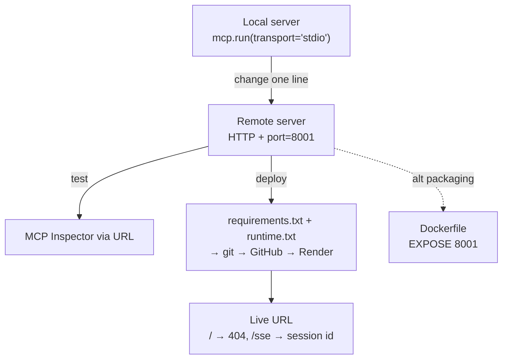

# Lesson 10 — Creating and Deploying Remote Servers

> **One-line:** Same server, new [[transport]] — flip from [[stdio-transport]] to HTTP, set a port,
> and deploy so *anyone* can reach it as a [[remote-server]].

## Concept map



> [!warning] Staleness
> **The course teaches a deprecated transport.** The recorded server uses
> `mcp.run(transport='sse')` (standalone Server-Sent Events) because, *at recording time*, the Python
> SDK didn't yet support Streamable HTTP. SSE was **deprecated as a standalone transport in MCP spec
> `2025-03-26`**. Today, use [[streamable-http-transport]]:
> ```python
> # OLD (raw/assignments/L9/mcp_project/research_server.py)
> mcp = FastMCP("research", port=8001)
> mcp.run(transport='sse')
> # NEW
> mcp = FastMCP("research", host="0.0.0.0", port=8001)
> mcp.run(transport='streamable-http')
> ```
> Clients connect with `streamablehttp_client(url)` (from `mcp.client.streamable_http`) instead of the
> old `sse_client`; the Inspector picks "Streamable HTTP" not "SSE". The instructor himself notes the
> swap "should be a very quick change." See `reports/modernization.md` finding #1.

## Why this lesson exists

Everything so far ran **locally over stdio** — the host spawned the server as a subprocess on the same
machine. A [[remote-server]] lives behind a URL so clients anywhere can reach it. The course's headline
point: **you barely change the server**, only the transport line and a port.

## Key ideas

### Local → remote is (almost) one line
Compared to the [[05-creating-an-mcp-server]] server, only two things change: a `port` on `FastMCP(...)`
and the `mcp.run(transport=...)` call. Tools, resources, and prompts are identical.

### Test with the Inspector over a URL
Launch `npx @modelcontextprotocol/inspector`, set the proxy address, choose the transport type, and
enter the server **URL** (not a launch command). List resources / templates / prompts / tools just as
with the local server — the protocol is transport-agnostic. See [[mcp-inspector]].

### Deploy: make uv-managed deps portable, then push
The course deploys to **Render**, which doesn't support `uv`, so dependencies are converted for pip:
```bash
echo ".env" > .gitignore                 # keep secrets out of git
uv pip compile pyproject.toml -o requirements.txt   # uv lock → pip format
# runtime.txt → "python-3.11.11"  (pin the Python version for Render)
git init && git add -A && git commit -m "ready for deployment"
git push origin main                     # to a new GitHub repo
```
On Render: **New → Web Service**, point at the GitHub repo, set start command
`python research_server.py`, pick the free plan, deploy. Render reads `runtime.txt`, installs from
`requirements.txt`, and runs the server.

### Verifying a live deployment
Visiting `/` returns **404** (expected — there's no root route). Hitting **`/sse`** returns a response
with a **session id**, confirming the MCP endpoint is live. (Post-modernization the endpoint is the
Streamable HTTP path instead.)

### Docker is an alternative packaging path
`raw/assignments/L9/mcp_project/Dockerfile` containerizes the same server:
```dockerfile
FROM python:3.11-slim
RUN pip install uv
COPY pyproject.toml uv.lock ./
RUN uv pip install --system .
COPY research_server.py .
EXPOSE 8001
CMD ["uv", "run", "research_server.py"]
```

## Connections
- ⬅ Re-points the local stdio server from [[05-creating-an-mcp-server]]; tests with [[mcp-inspector]]
- ➡ Remote servers raise new concerns — authentication (OAuth 2.1), discovery — covered in [[11-conclusion]]
- 📖 [[remote-server]] · [[streamable-http-transport]] · [[transport]]

> [!tip] Phone takeaway
> Going remote is mostly a **transport swap**: stdio → HTTP, add a port, deploy the repo. Just don't
> ship the course's `sse` — use `streamable-http`.
