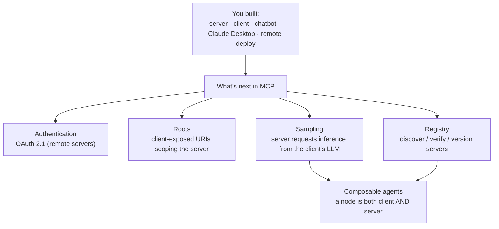

# Lesson 11 — Conclusion

> **One-line:** Recap of what you built (servers, clients, hosts, remote deploy) plus the MCP
> roadmap — **authentication, roots, sampling, a server registry,** and MCP as the substrate for agents.

## Concept map

## Why this lesson exists

You've covered the **core** of MCP — the [[mcp-architecture]] of [[mcp-host]] / [[mcp-client]] /
[[mcp-server]], the three server primitives ([[tools]], [[resources]], [[prompt-templates]]), and a
[[remote-server]] deploy. This lesson maps the **frontier**: the parts of the protocol still in active
development, which is where the ecosystem is heading.

## What you actually built: a real host in miniature

The chatbot from [[06-creating-an-mcp-client]] / [[07-connecting-the-mcp-chatbot-to-reference-servers]]
is a small but faithful **MCP host** — the same role Claude Desktop and Claude Code play. The three
server primitives you wired surface in those products as affordances you use every day, and *which*
affordance is dictated by **who controls invocation** (the full story: [[mcp-control-model]]):

| primitive | controlled by | real-client surface | delivers |
|---|---|---|---|
| [[tools]] | the **model** | autonomous "🔧 using *X*…" actions (with an approval gate) | an answer to splice back into the loop |
| [[resources]] | the **app / user** | **`@`-mention / attach context** | data to **inject** |
| [[prompt-templates]] | the **user** | **`/` slash command** | a conversation to **run** |

So `@`-context and `/`-commands aren't separate magic — they're the resource and prompt primitives you
implemented, surfaced in a polished UI. (Tellingly, Claude Code even namespaces MCP prompts as
`/mcp__<server>__<prompt>` — the same `__` scheme you reverse-engineered for tool names.)

**The gap from your miniature to a production host** is the frontier below *plus* two things the
course's stdio path skips: **per-tool permission/approval gating** (needed precisely because the model
is the actor), and **remote transport + OAuth** (Lesson 10's Streamable HTTP is the on-ramp). The
remaining pieces — sampling, roots, elicitation, a registry — are genuinely still-maturing protocol:

## Key ideas — what's beyond the course

### Authentication (OAuth 2.1)
Added in the March spec update as the means for clients/servers to make **authenticated** requests to
data sources. Optional but **highly recommended for remote servers** (local stdio just uses environment
variables, so it doesn't need this). Flow: client → server → user authenticates → token exchanged →
authenticated requests.

### Client-side primitives: roots & sampling
The course covered server-exposed primitives; clients can expose primitives too.
- **Roots** — a URI the *client* suggests the server should operate within (e.g. only these folders).
  Gives security/scoping; any valid URI, including HTTP.
- **Sampling** — the server **requests inference from the client's LLM**, reversing the usual direction.
  Lets a server (e.g. diagnosing a slow site from logs) get model help **without** dumping all its data
  into the client's context or crossing security boundaries. Enables "sampling loops."

### Composable / recursive agents
Because **a node can be both a client and a server**, you can build multi-agent architectures: an agent
(analysis, coding, research) is an MCP server to its caller *and* an MCP client to others. MCP is
positioned as a **foundational protocol for agents**.

### A unified server registry
A planned standard for **discovering, verifying, and versioning** servers — addressing the "many servers,
some malicious" problem (like npm/PyPI). Combined with auth and a well-known `MCP JSON` file (endpoint +
capabilities + required auth), this enables **dynamic discovery**: an agent finds, installs, and queries
the right server on demand (e.g. "manage my Shopify store").

### Other open threads
Smooth **stateful ↔ stateless** transition as Streamable HTTP adoption grows; preventing **tool naming
collisions** across servers; maturing sampling and auth/authorization at scale.

> [!warning] Staleness
> Roadmap content, not code — nothing to break. Note the lesson predates wide Streamable HTTP support;
> that transition is now the current default (see [[10-creating-and-deploying-remote-servers]]).

## Connections
- ⬅ Caps the build arc that started at [[02-why-mcp]] / [[03-mcp-architecture]]
- ➡ Reference material in [[12-appendix-tips-and-help]]
- 📖 [[remote-server]] · [[mcp-architecture]]

> [!tip] Phone takeaway
> Core MCP = host/client/server + tools/resources/prompts — and you built a real host in miniature:
> **tool = model-driven action, resource = `@`-context, prompt = `/`-command** ([[mcp-control-model]]).
> The frontier = **OAuth auth, roots, sampling (server asks the LLM), and a registry** — plus
> permission gating — the pieces that turn MCP into agent infrastructure.
